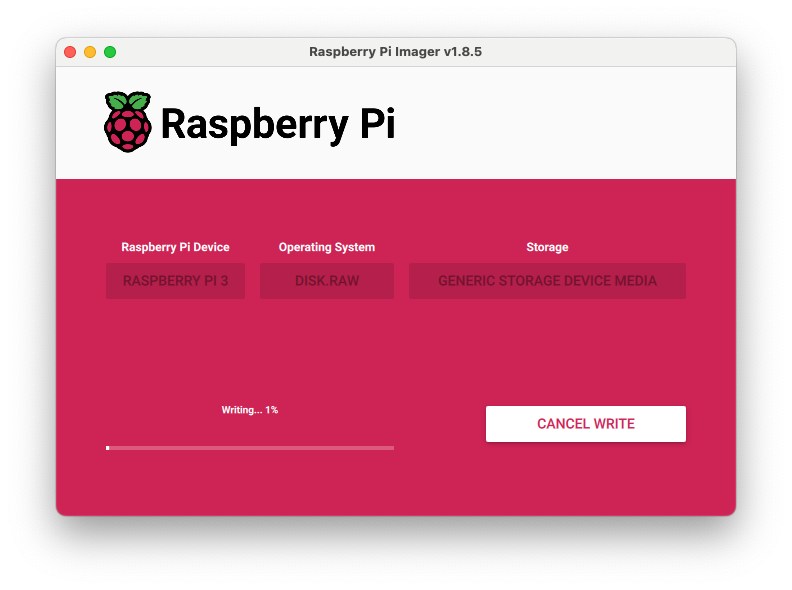

# Build [Fedora Bootc](https://docs.fedoraproject.org/en-US/bootc/) Images for the Raspberry Pi

This project aims at providing an easy way to build and manage Fedora bootc images for the Raspberry Pi.
Once installed on your device, updates to your system happen in form of container images.
Follow the instructions below to create your own OS.

Current Blocker: https://github.com/osbuild/bootc-image-builder/issues/701

Older Raspberry Pis (as my RPI3) require the boot partition to be MBR.  Bootc Image Builder is working on supporting that at the present.

## Customizing the OS

The OS can be customized in the Containerfile which uses the `fedora-bootc` base image and adds only a few packages on top.
The idea is to containerize applications instead of making them part of the bootc host.
This way, updates to applications are decoupled from the OS and do not require a reboot of the system.

## Build Steps

You can use the Makefile to automate most of the tasks involved:
* `make oci-image` to build the OCI image
* `make disk-image` to convert the OCI image into a disk image

Before running `make disk-image`, make sure to copy your public SSH key into the `config.toml`.
The build steps require root privileges.
On Linux, make sure to run as root (or via sudo).
On Mac OS and Windows, make sure that your podman machine runs as root.

You can use the following variables to tweak the image via `make $VARIABLE=$VALUE`:
* `OCI_IMAGE` to change the reference of the OCI image (default: `quay.io/vrothberg/fedora-bootc-pi:41`)
* `DISK_TYPE` to change the type of the disk image (default: `raw`)
* `ROOTFS` to change the default filesystem of the disk image (default: `xfs`)
* `ARCH` to change the architecture of the OCI and disk image (default: `arm64`)

Changing the variables may come in handy if you desire to run the disk image in a VM before.
For more information on supported values and next steps, please refer to the [bootc-image-builder](https://github.com/osbuild/bootc-image-builder) and the [Fedora Bootc documentation](https://docs.fedoraproject.org/en-US/bootc/).

**Note**: If you are running on another platform than ARM64, the build steps will take longer due to emulation.  There are currently issues when emulating ARM64 on AMD64.

## Flashing an SD Card

For flashing the disk image to an SD card you may use the official Raspberry Pi [Imager](https://www.raspberrypi.com/software/) tool.

## Firmware

We are almost done.  The last step is to fiddle with some firmware files, which are explained in a [great blog post by Ben Breard](https://mrguitar.net/?p=2605).  To download the files, just run `make firmware` and then copy the files onto your SD card as explained by Ben.  Note you may not be able to mount the SD card anymore on Mac OS.
